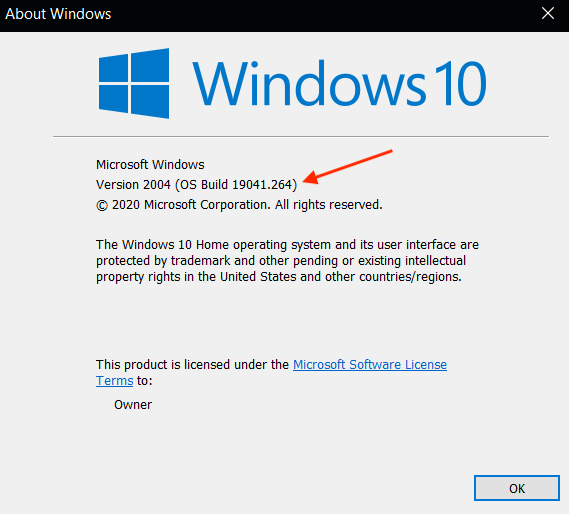

# Set-Up

In this section, we're going to get everything we need ready to complete the workshop steps.

Here's what you'll need:

1. [Clone the repo to your local machine](#clone-the-repo-to-your-local-machine)
2. [Install Terraform](#install-terraform)
3. [Windows Instructions](#windows-instructions)
4. [Have a personal AWS account](#personal-aws-account)
5. [Install AWS CLI and auth via the commandline](#install-the-aws-cli-and-auth-via-the-command-line)
6. [Have a code editor of your choice](#code-editor)

---

## Clone the Repo to your local machine

Clone this repo. You're going to make it your own and make edits. It's yours to keep and play around.

Choose a directory where you'd like to clone this repo to (it could even just be your desktop)

Run the following in your command line

```
git clone git@github.com:DevOps-Represent/terraform-workshop.git
```

If you don't have a GitHub account, download the zip folder of the repo:
[Repo Zip Download](https://github.com/DevOps-Represent/terraform-workshop/archive/refs/heads/main.zip)

## Install Terraform

Terraform is used via commands in the command line. For these to work, you need to install it.

Here's how:

### Mac

Follow the instructions below, let the coaches know if you get stuck!

1. Find out what chip version your Mac is. 

e.g. If your Mac has an Intel processor it's likely AMD64. Newer Macs use the M series chips which are ARM64. 

You can check by navigating to `About this mac` or typing into your terminal `arch`

2. [Download the binary from Hashicorp](https://developer.hashicorp.com/terraform/install)
Download the version that matches the chip above

3. Unzip the binary zip

4. Copy binary to a place in the path such as /usr/local/bin/terraform
```
cp $HOME/Downloads/terraform /usr/local/bin/
```

5. Check it's installed
```
terraform -v
```

Alternatively, you may also be able to run the following:

```
brew tap hashicorp/tap
brew install hashicorp/tap/terraform
```

This is a good option if you've used `brew` previously for installing software onto your Mac

## Windows Instructions

This walkthrough has a few options for installing Terraform for Windows, take the time to have a look at what best works for you:

#### WSL Install (Linux on Windows)

Check your version of Windows

- Press `Windows key` + `R`
- Type: `winver`
  Recquired Version: 1903 or higher



- If the version is OK, follow these instructions [Windows Subsystem for Linux Installation Guide for Windows 10](https://docs.microsoft.com/en-us/windows/wsl/install-win10)

#### Docker Install (Ubuntu)

- If the version is older, then the easiest option is to use Docker - [Install Docker for Windows](https://docs.docker.com/docker-for-windows/install/)

- Run docker to spin up a Ubuntu container:
```
docker run -it -v //C/path/to/repo:/devopsrepresent-terraform ubuntu:latest --name devopsrepresent-terraform
```

Once you have WSL or Ubuntu using docker, you can now follow the same instructions for Mac to install Terraform

**Here's a link for [Trouble Shooting Tips](https://docs.microsoft.com/en-us/windows/wsl/install-win10#manual-installation-steps)**

## Personal AWS Account

If you don't already have one, you'll have to set up a personal AWS account. If you don't have one, having an AWS account is key if you intend on continuing your AWS learning journey after this workshop.

If you DO have an account make sure of the following
* You must have privileged access otherwise make a new AWS account
* You are logged in as an IAM user. 
[Root user vs IAM User in AWS Explained.](https://blog.jannikwempe.com/aws-accounts-iam-users-root-user)
* Your IAM user has permissions to deploy resources (s3, Cloudformation, DymamoDB)

If you DONT have an account, go [HERE](https://aws.amazon.com/) to create one, you'll need a credit card - Don't worry no cost will be incured today

## Install the AWS CLI and auth via the command line

As we're running commands via the command line that will allow you to deploy AWS resources, you need to authenticate to your personal AWS via the command line.

Here's install instructions for all operating systems: [How to install the AWS CLI 2](https://docs.aws.amazon.com/cli/latest/userguide/install-cliv2.html)

### Here's the instructions on how to authenticate via your command line:

NOTE: you'll need to get some details from the AWS web console that'll need to be copy and pasted for this to work

[AWS instructions on how to configure your command line](https://docs.aws.amazon.com/cli/latest/userguide/cli-authentication-user.html)

For production systems, check out the other ways of setting up AWS CLI such as [IAM role, Short-term credentials or SSO.](https://docs.aws.amazon.com/cli/latest/userguide/getting-started-quickstart.html#getting-started-quickstart-new-command)

It'll look something like this:

```
aws configure
```

Then following that these are the prompts you need to provide:

- AWS Access Key ID
- AWS Secret Access Key
- Default region name (for Australia, choose ap-southeast-2)
- Default output format (you can just choose nothing)

Run this command after you are done to check your access
```
aws sts get-caller-identity
```
This should return something like: 
```
{
    "UserId": "XXXXXX",
    "Account": "000000",
    "Arn": "arn:aws:iam::0000000:user/your-username"
}
```
<details>
 <summary>Got an error like "The security token included in the request is invalid" ?</summary>

You may need to do the following commands

```
rm ~/.aws/credentials
aws configure
```

Deleting the configuration file and redoing it stops AWS from trying to use an expired or incorrect token value when authenticating.</details>


 


## Code Editor

We're going to be writing and editing lines of Terraform config. To do this, it's best to use a code editor.

There's lots of free versions, here's a few to pick from if you don't already have one:

[Visual Studio Code](https://code.visualstudio.com/)

[Atom](https://github.com/atom)

[Sublime Text 3](https://www.sublimetext.com/3)

Here's an even longer [list](https://hackr.io/blog/web-development-ide)

## [NEXT SECTION - Key Concepts 👉🏽](01-key-concepts.md)
