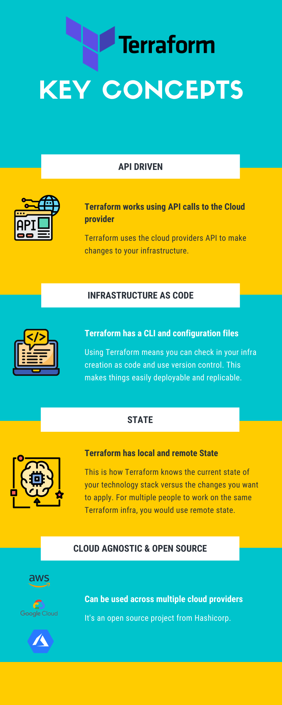

# Key Concepts
This section will cover the key concepts we're going to be referencing throughout the workshop.

## What is Terraform?
Terraform is an open-source tool for building infrastructure/service as code. It was created by Hashicorp and is maintained and updated by a very active open-source community.

Terraform is made up of its own command line tool, syntax and file/directory structure.

Terraform is cloud agnostic. This means, you can deploy your infrastructure across multiple cloud providers using the same method. This is unlike Cloudformation which is only used for AWS and Azure's Resource Manager templates for deploying to Azure only. 

Here's the [Full List of Providers](https://registry.terraform.io/search/providers?namespace=hashicorp)

## Why should I be learning Terraform?
Terraform makes infrastructure as code easy and is a really important tool if you want your tech stacks to be easily deployable, version controlled and replicable. 

When new services are introduced to cloud provides such as AWS, you're more likely to be able to deploy it using Terraform before Cloudformation - this is thanks to the highly active open-source community.

Terraform enables you to preview what your changes will do before you deploy. This can be helpful for key infra where you require a high confidence in your changes being deployed.

The documentation is excellent. This means using Terraform can be easier to learn that other methods for infra as code.

## More Key Concepts:

### Terraform isn't magic
Terraform works by using API calls to the Cloud Providers to make changes to your infrastructure. These are the same calls you can do via CLI tools. 

If you are using terraform for new features, you may need to check out the API documentation for your provider and the [terraform providers documentation](https://registry.terraform.io/browse/providers)

### Terraform has a CLI and Configuration
The configuration files can be checked into your version control as code. 
This can then be checked out by your team and using the Terraform CLI

- Teraform CLI can run locally to update resources in the cloud. 
- Used to revert back to an old version of the config (like before a bucket was removed etc)
- Made as a template to start a new terraform deployment off.
- Be linked to a build system CI / CD pipeline to automatically deploy your terraform. `e.g. When we check in our config to version control, build a bucket in this account.`

### Terraform enables teams to work together on infrastructure

Terraform supports State to know the current state of your technology stack vs the changes you want to make. 

This means it supports creating detailed plans to show you the changes you are going to make to resources before making the changes.

It also means that it can be set up to allow multiple people to work on the same infrastructure without conflicting API calls causing chaos. 
See more in the [Local vs remote state](03-local-vs-remote-state.md)

## [NEXT SECTION  - File Structure 👉🏽](02-file-structure.md)