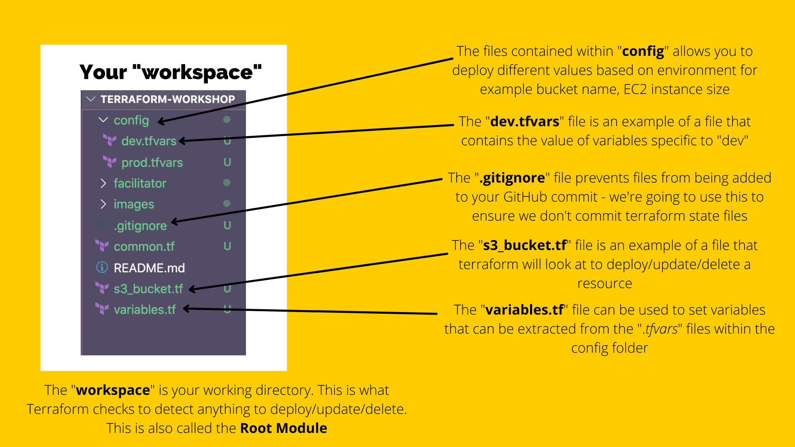

# File Structure
In this section we're going to talk about how your Terraform directory is set up. It's best to now open the repo you cloned in your text editor now.

You are in the `workspace` which is your working directory. This is what Terraform checks to detect anything to deploy or update or delete.

Using Terraform we can logically split up the files to make it easier to read, while enabling Terraform to automatically get the values it needs to create infra. 

## Let's take a look at the files that make up the repo:

`config` - Allow you to deploy different values based on environment. 
For example bucket name, EC2 instance size

`dev.tfvars` - contains the values of variables specific to dev

`.gitignore` - prevents files from being added to your GitHub commit. We use this to ensure we don't commit Terraform state files. 

`s3_bucket.tf` - A file terraform looks at to deploy or update or delete resources related to your s3 bucket. 

`variables.tf` - Used to set variables that can be extracted from the `.tfvars` files in the config folder

`common.tf` - A file used for blocks used across the workspace such as data resources or tags. 

`terraform.tf` - The file used to configure Terraform and the providers (API's) you are using. 

## [NEXT SECTION  - Remote State Set Up 👉🏽](03-local-vs-remote-state.md)
