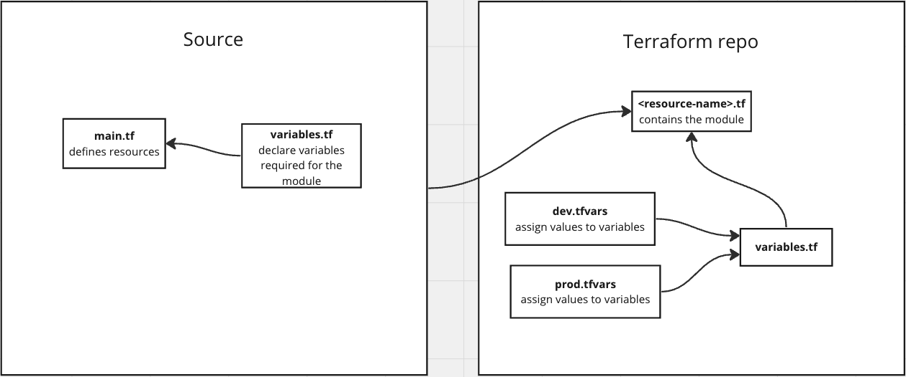

# Modules

Terraform modules are self-contained packages of Terraform configuration that encapsulate resources and their config. This allows developers to easily reuse infrastructure configuration across different projects without the need to repeatedly write similar IaC for each project.

Modules are simply resources that are made reusable so that when working in teams, other team members can consistently deploy resources.

Benefits of using modules include:

- Reusability
- Abstraction
- Standardization

## File structure

The typical file structure for a Terraform module is:

```
.
├── README.md
├── main.tf
├── variables.tf
└── outputs.tf
```

- The `README.md` file contains documentation describing how to use the module such as an example.

- The `main.tf` file is the main set of configurations for the module, containing resource blocks and definitions.

- The `variables.tf` file contains all the values that need to be passed to this module which will be configured as arguments in the resource blocks of the `main.tf` file. Any variables that not given a default value will be a required argument, otherwise they are optional. Variables declared here are only used internally within the module.

- The `outputs.tf` file is an optional file that contains any values that should be exported to be used as input for other assets. This is similar to a `return` statement in other programming languages.

## Understanding how modules work

To use a module, you reference it within your Terraform configuration files using its source location, which can be a local file path `eg. modules/aws-s3-static-website-bucket`, or a remote URL pointing to a versioned module repository `eg. terraform-aws-modules/s3-bucket/aws`.

Modules can be shared within an organization, publicly on platforms like the Terraform Registry, or privately within a version control system.

You can then instantiate the module multiple times with different input variables to customize its behavior for specific use cases or environments. For example, we could created 2 different s3 buckets in the same account by providing 2 different names. We don't need to know the details of how the buckets are deployed and what resources are required due to the abstraction and encapsulation the module provides.



## Making your own local Terraform module

Now we are going to turn what we just made into a Terraform module. The module should deploy all the resources required for a static website bucket without the need to manually code them out. We should only need to provide the module the required variables and it should do the rest.

### Local module

1. Create the required files - `main.tf` and `variables.tf` inside `modules/aws-s3-static-website-bucket`
2. Add the required resources needed for a static website bucket in `main.tf`. (Hint: refer to `s3_bucket.tf`)
3. Declare variables in `variables.tf` and add them to `main.tf` as arguments

### Variables

4. Create a new module object in `dev.tfvars`. These will be the variables you pass in to your module

```
my_module_1 = {
  name = "example1_bucket"
  tags = "bucket1 tag"
}

my_module_2 = {
  name = "example2_bucket"
  tags = "bucket2 tag"
}
```

5. Create new variables for the module names in the root `variables.tf` file so that you are able to see the changes when deploying multiple instances of a module.

### Module initialization

6. Create a new `.tf` file in the root directory to use the new module
7. Add the new module configuration in your new file. (Hint: refer to [s3 module example](https://github.com/terraform-aws-modules/terraform-aws-s3-bucket) and look at your module code to figure out what variables need to be passed in)
8. Do a terraform `plan` and `apply` to check if your module is working
